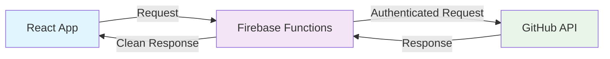

# 🛡️ Secure GitHub API Setup with Firebase Functions

This guide explains how to securely use GitHub API authentication without exposing your Personal Access Token (PAT) to client-side code.

## 🚨 Security Problem Solved

**Before**: GitHub PAT was embedded in client-side bundle via `VITE_GITHUB_TOKEN`
- ❌ Token visible in browser dev tools
- ❌ Token accessible to anyone visiting the site
- ❌ Token can be extracted and misused

**After**: GitHub PAT stored securely on Firebase Functions
- ✅ Token only exists on server-side
- ✅ Client makes requests through secure proxy
- ✅ No sensitive data exposed to users

## 📋 Prerequisites

1. Firebase CLI installed: `npm install -g firebase-tools`
2. Firebase project already set up (you have this)
3. GitHub Personal Access Token with `public_repo` scope

## 🚀 Setup Instructions

### Step 1: Install Firebase Functions Dependencies

```bash
cd functions
npm install
```

### Step 2: Configure GitHub Token (Server-Side)

**Important**: Do NOT use `VITE_` prefix anymore. This is server-side only.

```bash
# Set the GitHub token as a secret in Firebase Functions (2nd Gen)
firebase functions:secrets:set GITHUB_TOKEN

# You'll be prompted to enter your GitHub token securely
```

### Step 3: Deploy Firebase Functions

```bash
# Deploy functions to both staging and production
firebase use staging
firebase deploy --only functions

firebase use production  
firebase deploy --only functions
```

### Step 4: Remove Client-Side Token

1. **Remove** the `VITE_GITHUB_TOKEN` from your environment variables
2. **Delete** any `.env` files containing the token
3. **Update** your CI/CD to remove `VITE_GITHUB_TOKEN` from secrets

### Step 5: Test the Secure Implementation

```bash
# Start local development with Functions emulator
firebase emulators:start --only functions

# In another terminal, start your React app
npm run dev
```

Visit `http://localhost:5173` and verify:
- GitHub repositories load correctly
- No authentication tokens visible in browser dev tools
- Network requests go to Firebase Functions proxy

## 🔧 Development vs Production URLs

The service automatically detects the environment:

- **Local Development**: `http://localhost:5001/adam-wickenden/us-central1/githubProxy`
- **Staging**: `https://us-central1-adam-wickenden-dev.cloudfunctions.net/githubProxy`
- **Production**: `https://us-central1-adam-wickenden.cloudfunctions.net/githubProxy`

## 🛠️ How It Works

1. **Client Request**: React app makes request to Firebase Functions proxy
2. **Proxy Authentication**: Function adds GitHub token to request headers
3. **GitHub API Call**: Function calls GitHub API with authentication
4. **Secure Response**: Function returns data to client (no token exposed)



## 🔍 API Endpoints

### GitHub Proxy
- **URL**: `/githubProxy`
- **Method**: GET
- **Parameters**: 
  - `path`: GitHub API path (e.g., `users/adamwickenden/repos`)
  - Additional query parameters as needed

### Health Check
- **URL**: `/healthCheck`
- **Method**: GET
- **Response**: Server status and timestamp

## 🐛 Troubleshooting

### "GitHub token not configured" Error

```bash
# Set the token as a secret if missing
firebase functions:secrets:set GITHUB_TOKEN

# Redeploy functions
firebase deploy --only functions
```

### CORS Issues

The Functions are configured to allow requests from:
- `http://localhost:5173` (Vite dev server)
- `http://localhost:3000` (Alternative dev server)
- `https://adamwickenden.dev` (Production domain)
- `https://adam-website-staging.web.app` (Staging)
- `https://adam-website-production.web.app` (Production Firebase)

### Local Development Issues

1. Make sure Firebase emulators are running:
   ```bash
   firebase emulators:start --only functions
   ```

2. Check the Functions log:
   ```bash
   firebase functions:log
   ```

## 📊 Rate Limits

With authenticated requests through the proxy:
- **Authenticated**: 5,000 requests/hour
- **Much higher** than unauthenticated (60 requests/hour)

## 🔐 Security Best Practices

1. **Never** use `VITE_` prefix for sensitive tokens
2. **Always** use server-side proxy for API authentication
3. **Regularly** rotate your GitHub tokens
4. **Monitor** your token usage in GitHub settings
5. **Use** minimal required scopes for tokens

## 🚀 Deployment Commands

```bash
# Deploy everything (hosting + functions)
firebase deploy

# Deploy only functions
firebase deploy --only functions

# Deploy only hosting
firebase deploy --only hosting

# Deploy to specific project
firebase use production && firebase deploy
firebase use staging && firebase deploy
```

## ✅ Verification Checklist

After setup, verify:

- [ ] GitHub repositories load on your website
- [ ] No `VITE_GITHUB_TOKEN` in browser dev tools
- [ ] Network requests go to Firebase Functions
- [ ] Functions logs show successful GitHub API calls
- [ ] Rate limit is 5,000/hour (check GitHub settings)
- [ ] Both staging and production work correctly

## 📞 Support

If you encounter issues:

1. Check Firebase Functions logs: `firebase functions:log`
2. Verify token configuration: `firebase functions:config:get`
3. Test Functions locally: `firebase emulators:start --only functions`
4. Check GitHub token permissions in GitHub settings 